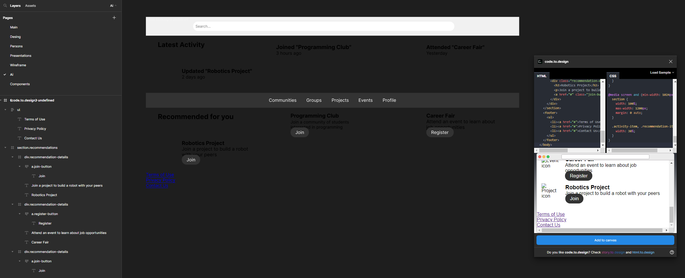
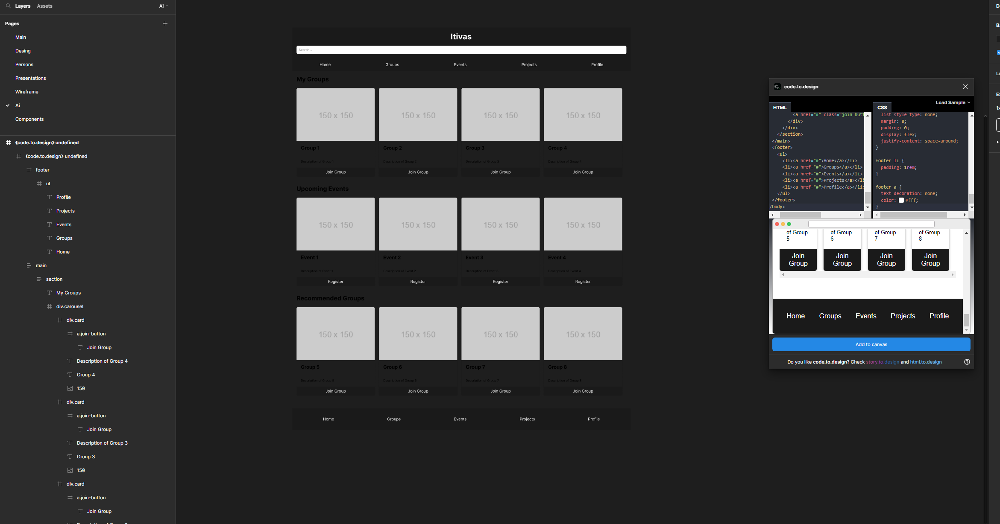
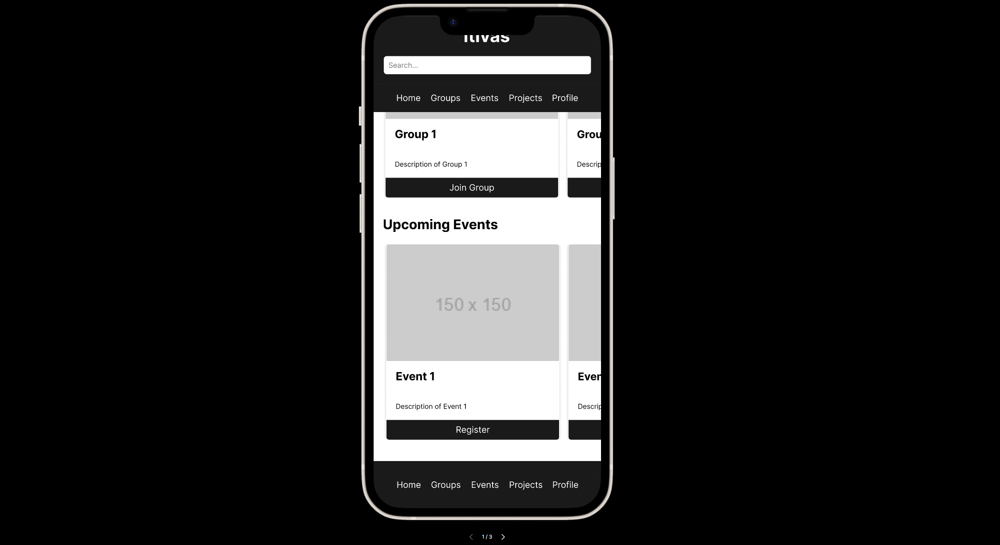

# Generating screen prototypes with ChatGPT

## How we will work

First after some investigation any of the tools that could help us generate examples directly in figma works as expected or are behind a paywall/waitlist, so we will use directly ChatGPT and plugin called code.to.design that will help us to translate the HTML and CSS generated in ChatGPT to designs in Figma.

## Initial prompt

ChatGPT works better with context, so, to get better result, we will create an initial prompt to provide all the context need, the things we think ChatGPT may need are:
Context of the application
Context or description of the section
What usability considerations may need to design the screen

So, with these in mind, we first prompt will be this:

> Itivas is a mobile app social networking platform designed to allow students of FMAT to connect with different communities, groups, and projects within their school. Its purpose is to increase social cohesion and a sense of belonging among students by facilitating engagement with their peers and school community.
> The main goal of the app is to improve the student experience at FMAT by providing students with a platform to explore their interests, participate in activities and events, and build meaningful relationships with their peers. By fostering social cohesion, the software aims to enhance student engagement, academic success and overall satisfaction with the FMAT experience.
> The objectives of the software are to:
>
> - Provide a comprehensive directory of different communities, groups, and projects within FMAT to increase awareness and engagement.
> - Enable students to find groups of peers who share their interests and skills as well as activities and events to participate in.
> - Provide students with a platform to organize and direct their own teams and projects, promoting initiative and leadership.
> - Provide feedback and rating systems to assist students in selecting the groups they will join.
> - Increase student engagement and social cohesiveness. This will aid the FMAT in fostering a sense of community among students and addressing issues like loneliness and anxiety.
>   So, your work as a mobile app designer will be to design the prototype of the mobile app, this first screen will be The main dashboard, that is the primary landing page of the app, providing an overview of the user's activity and allowing them to access different features and sections of the app. The dashboard will be personalized for each user, displaying information relevant to their interests, groups, and activities on the app.

### ChatGPT response

> As a mobile app designer, my approach to designing the main dashboard for Itivas would be to create a clean, intuitive, and visually appealing interface that is easy to use and navigate. The dashboard should be personalized to each user, displaying relevant information based on their interests, groups, and activities on the app.
> The main dashboard should feature a header section with the app logo, search bar, and user profile avatar. Below the header, there should be a carousel section displaying the user's latest activity, such as recent groups joined, events attended, and new project updates.
> The main dashboard should also include a navigation menu, providing quick access to the different sections of the app, such as "Communities," "Groups," "Projects," "Events," and "Profile." Each section should have a unique icon and a label that clearly communicates its purpose.
> In addition, the main dashboard should have a section that recommends new groups, events, and projects based on the user's interests and activity history. This section should also include a "See All" button that allows users to explore more recommendations.
> Finally, the dashboard should have a footer section with links to the app's terms of use, privacy policy, and contact information. It should also include social media icons that allow users to share the app with their friends and followers.
> Overall, the main dashboard of Itivas should be designed to provide a comprehensive overview of the user's activity on the app and make it easy for them to navigate to different features and sections. By providing personalized recommendations and a user-friendly interface, the app can foster social cohesion and a sense of belonging among students at FMAT.

## Generating the HTML and CSS for the Main Dashboard

```html
<!DOCTYPE html>
<html>
  <head>
    <meta charset="UTF-8" />
    <meta name="viewport" content="width=device-width, initial-scale=1.0" />
    <title>Itivas Main Dashboard</title>
    <link rel="stylesheet" href="style.css" />
  </head>
  <body>
    <header>
      
      <input type="text" placeholder="Search..." />
      
    </header>
    <section class="carousel">
      <h2>Latest Activity</h2>
      <div class="activity-item">
        
        <div class="activity-details">
          <h3>Joined "Programming Club"</h3>
          <p>3 hours ago</p>
        </div>
      </div>
      <div class="activity-item">
        
        <div class="activity-details">
          <h3>Attended "Career Fair"</h3>
          <p>Yesterday</p>
        </div>
      </div>
      <div class="activity-item">
        
        <div class="activity-details">
          <h3>Updated "Robotics Project"</h3>
          <p>2 days ago</p>
        </div>
      </div>
    </section>
    <nav>
      <ul>
        <li><a href="#">Communities</a></li>
        <li><a href="#">Groups</a></li>
        <li><a href="#">Projects</a></li>
        <li><a href="#">Events</a></li>
        <li><a href="#">Profile</a></li>
      </ul>
    </nav>
    <section class="recommendations">
      <h2>Recommended for you</h2>
      <div class="recommendation-item">
        
        <div class="recommendation-details">
          <h3>Programming Club</h3>
          <p>Join a community of students interested in programming</p>
          <a href="#" class="join-button">Join</a>
        </div>
      </div>
      <div class="recommendation-item">
        
        <div class="recommendation-details">
          <h3>Career Fair</h3>
          <p>Attend an event to learn about job opportunities</p>
          <a href="#" class="register-button">Register</a>
        </div>
      </div>
      <div class="recommendation-item">
        
        <div class="recommendation-details">
          <h3>Robotics Project</h3>
          <p>Join a project to build a robot with your peers</p>
          <a href="#" class="join-button">Join</a>
        </div>
      </div>
    </section>
    <footer>
      <ul>
        <li><a href="#">Terms of Use</a></li>
        <li><a href="#">Privacy Policy</a></li>
        <li><a href="#">Contact Us</a></li>
      </ul>
    </footer>
  </body>
</html>
```

```css
/* Global Styles */
* {
  box-sizing: border-box;
  margin: 0;
  padding: 0;
}

body {
  font-family: Arial, sans-serif;
}

header {
  display: flex;
  justify-content: space-between;
  align-items: center;
  padding: 16px;
  background-color: #f1f1f1;
}

input[type="text"] {
  width: 70%;
  padding: 8px;
  border-radius: 16px;
  border: none;
  outline: none;
}

nav {
  display: flex;
  justify-content: space-around;
  align-items: center;
  background-color: #333;
  color: #fff;
  padding: 8px;
}

nav ul {
  display: flex;
  list-style: none;
}

nav li {
  margin: 0 16px;
}

nav a {
  text-decoration: none;
  color: #fff;
}

section {
  padding: 16px;
}

h2 {
  margin-bottom: 16px;
}

.activity-item {
  display: flex;
  align-items: center;
  margin-bottom: 16px;
}

.activity-item img {
  width: 64px;
  height: 64px;
  margin-right: 16px;
}

.recommendation-item {
  display: flex;
  align-items: center;
  margin-bottom: 16px;
}

.recommendation-item img {
  width: 64px;
  height: 64px;
  margin-right: 16px;
}

.join-button,
.register-button {
  background-color: #333;
  color: #fff;
  padding: 8px 16px;
  border-radius: 16px;
  text-decoration: none;
  margin-left: auto;
}

.join-button:hover,
.register-button:hover {
  background-color: #fff;
  color: #333;
  border: 1px solid #333;
}

/* Media Queries */
@media screen and (min-width: 768px) {
  body {
    padding: 16px;
  }

  header {
    padding: 16px 0;
  }

  nav {
    padding: 16px 0;
  }

  section {
    display: flex;
    flex-wrap: wrap;
    justify-content: space-between;
  }

  .activity-item,
  .recommendation-item {
    width: 48%;
  }
}

@media screen and (min-width: 1024px) {
  section {
    width: 100%;
    max-width: 1200px;
    margin: 0 auto;
  }

  .activity-item,
  .recommendation-item {
    width: 30%;
  }
}
```

### Adding code to Figma

After adding the code to the plugin in Figma this is the result



## Adding more prompts to improve the result

After those result, we decide to provide more prompts to ChatGPT to do some changes. We add the following prompt:

> Make this adjustments to the HTML:
>
> - The footer will be navigation menu that you described
> - The current foorter will be removed
> - Provide styles for the carrousel to show the events and groups as card

```html
<!DOCTYPE html>
<html>
  <head>
    <meta charset="UTF-8" />
    <meta name="viewport" content="width=device-width, initial-scale=1.0" />
    <title>Itivas | Main Dashboard</title>
    <link rel="stylesheet" type="text/css" href="style.css" />
  </head>
  <body>
    <header>
      <h1>Itivas</h1>
      <input type="text" placeholder="Search..." />
    </header>
    <nav>
      <ul>
        <li><a href="#">Home</a></li>
        <li><a href="#">Groups</a></li>
        <li><a href="#">Events</a></li>
        <li><a href="#">Projects</a></li>
        <li><a href="#">Profile</a></li>
      </ul>
    </nav>
    <main>
      <section>
        <h2>My Groups</h2>
        <div class="carousel">
          <div class="card">
            
            <h3>Group 1</h3>
            <p>Description of Group 1</p>
            <a href="#" class="join-button">Join Group</a>
          </div>
          <div class="card">
            
            <h3>Group 2</h3>
            <p>Description of Group 2</p>
            <a href="#" class="join-button">Join Group</a>
          </div>
          <div class="card">
            
            <h3>Group 3</h3>
            <p>Description of Group 3</p>
            <a href="#" class="join-button">Join Group</a>
          </div>
          <div class="card">
            
            <h3>Group 4</h3>
            <p>Description of Group 4</p>
            <a href="#" class="join-button">Join Group</a>
          </div>
        </div>
      </section>
      <section>
        <h2>Upcoming Events</h2>
        <div class="carousel">
          <div class="card">
            
            <h3>Event 1</h3>
            <p>Description of Event 1</p>
            <a href="#" class="register-button">Register</a>
          </div>
          <div class="card">
            
            <h3>Event 2</h3>
            <p>Description of Event 2</p>
            <a href="#" class="register-button">Register</a>
          </div>
          <div class="card">
            
            <h3>Event 3</h3>
            <p>Description of Event 3</p>
            <a href="#" class="register-button">Register</a>
          </div>
          <div class="card">
            
            <h3>Event 4</h3>
            <p>Description of Event 4</p>
            <a href="#" class="register-button">Register</a>
          </div>
        </div>
      </section>
      <section>
        <h2>Recommended Groups</h2>
        <div class="carousel">
          <div class="card">
            
            <h3>Group 5</h3>
            <p>Description of Group 5</p>
            <a href="#" class="join-button">Join Group</a>
          </div>
          <div class="card">
            
            <h3>Group 6</h3>
            <p>Description of Group 6</p>
            <a href="#" class="join-button">Join Group</a>
          </div>
          <div class="card">
            
            <h3>Group 7</h3>
            <p>Description of Group 7</p>
            <a href="#" class="join-button">Join Group</a>
          </div>
          <div class="card">
            
            <h3>Group 8</h3>
            <p>Description of Group 8</p>
            <a href="#" class="join-button">Join Group</a>
          </div>
        </div>
      </section>
    </main>
    <footer>
      <ul>
        <li><a href="#">Home</a></li>
        <li><a href="#">Groups</a></li>
        <li><a href="#">Events</a></li>
        <li><a href="#">Projects</a></li>
        <li><a href="#">Profile</a></li>
      </ul>
    </footer>
  </body>
</html>
```

```css
body {
  margin: 0;
  padding: 0;
  font-family: Arial, sans-serif;
}

header {
  background-color: #1a1a1a;
  color: #fff;
  display: flex;
  flex-direction: column;
  align-items: center;
  padding: 1rem;
}

header h1 {
  margin: 0;
}

header input[type="text"] {
  border: none;
  background-color: #fff;
  padding: 0.5rem;
  border-radius: 5px;
  width: 100%;
  margin-top: 1rem;
}

nav {
  background-color: #1a1a1a;
  color: #fff;
}

nav ul {
  list-style-type: none;
  margin: 0;
  padding: 0;
  display: flex;
  justify-content: space-around;
}

nav li {
  padding: 1rem;
}

nav a {
  text-decoration: none;
  color: #fff;
}

main {
  padding: 1rem;
}

section {
  margin-bottom: 2rem;
}

section h2 {
  margin-top: 0;
}

.carousel {
  display: flex;
  overflow-x: scroll;
  scroll-snap-type: x mandatory;
  scroll-behavior: smooth;
}

.card {
  scroll-snap-align: center;
  width: 300px;
  margin-right: 1rem;
  box-shadow: 0 0 5px rgba(0, 0, 0, 0.3);
  border-radius: 5px;
  overflow: hidden;
}

.card img {
  width: 100%;
  height: 200px;
  object-fit: cover;
}

.card h3 {
  margin: 0;
  padding: 1rem;
  font-size: 1.2rem;
  font-weight: bold;
}

.card p {
  margin: 0;
  padding: 1rem;
  font-size: 0.8rem;
}

.join-button,
.register-button {
  display: block;
  background-color: #1a1a1a;
  color: #fff;
  text-align: center;
  padding: 0.5rem;
  text-decoration: none;
}

.join-button:hover,
.register-button:hover {
  background-color: #000;
}

footer {
  background-color: #1a1a1a;
  color: #fff;
  padding: 1rem;
}

footer ul {
  list-style-type: none;
  margin: 0;
  padding: 0;
  display: flex;
  justify-content: space-around;
}

footer li {
  padding: 1rem;
}

footer a {
  text-decoration: none;
  color: #fff;
}
```

### Adding code to Figma



## Adjusting the design to be more mobile-like in Figma

As we can see, even we provide context that the design is for mobile, it still looks a bit weird. Let's adjust it to be more mobile-like. With Figma, we can do this with adding a Frame with the size of the mobile device we want to design for. In this case, we'll use the iPhone 14. Also we resize the content and add auto-layout.

_Click on the image to see the video_
[](https://youtu.be/5ZCJx43-Zio)

## Conclusions

As we can see, the use of AI in design can be very useful. We can use it to generate a design that and then adjust to our needs. We can also use it to generate a design that we can use as a starting point for our own design like we did in this document. Maybe with better prompts, context and more relevant information we can get better results. But for now, it's a good starting point to understant how to use this technology.
