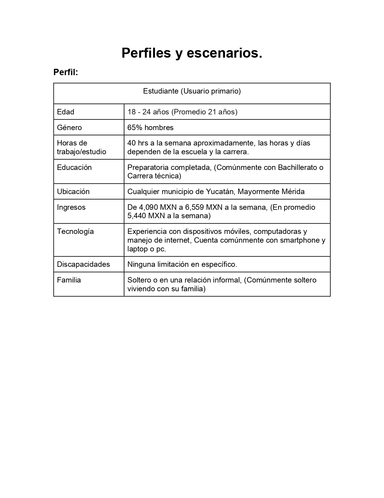
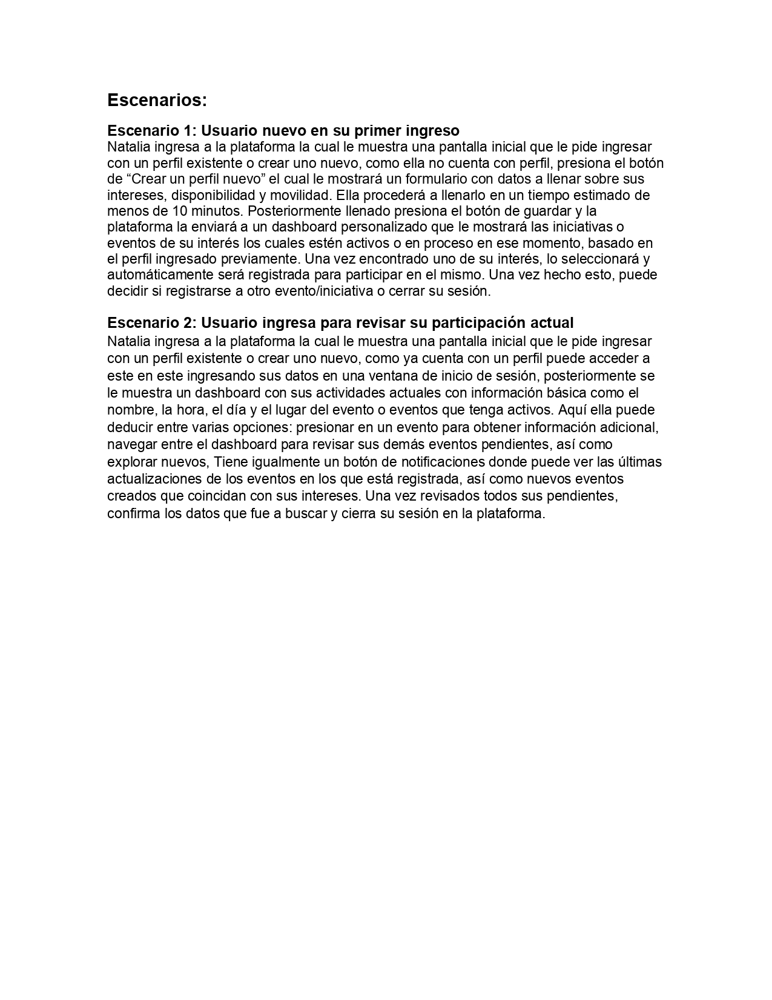
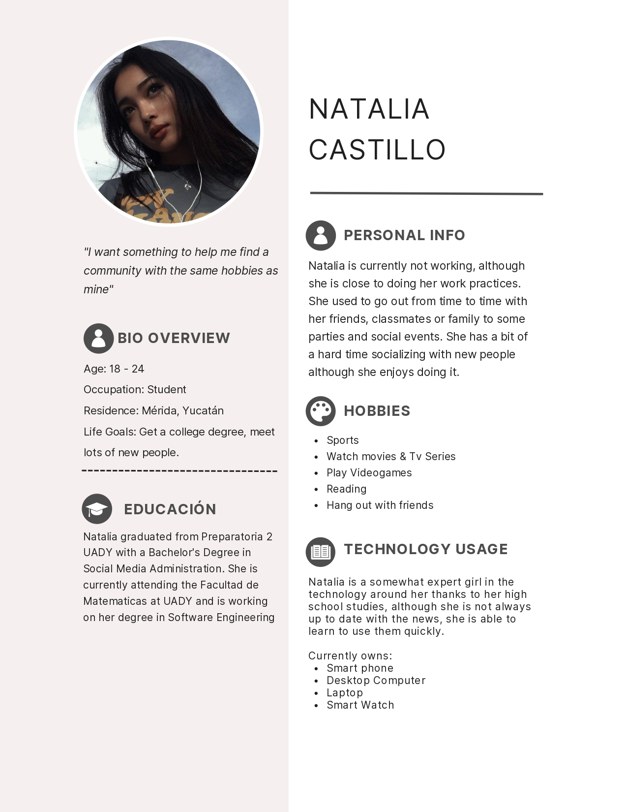
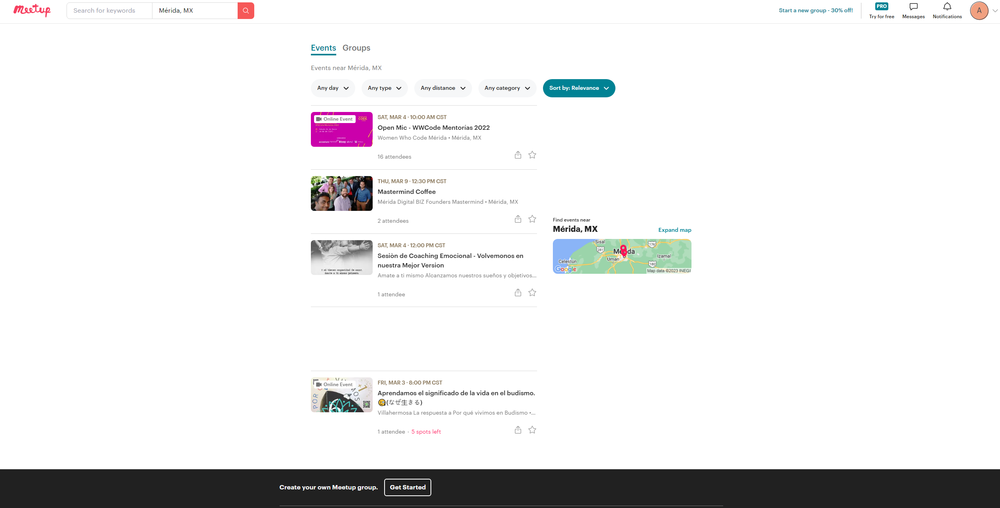
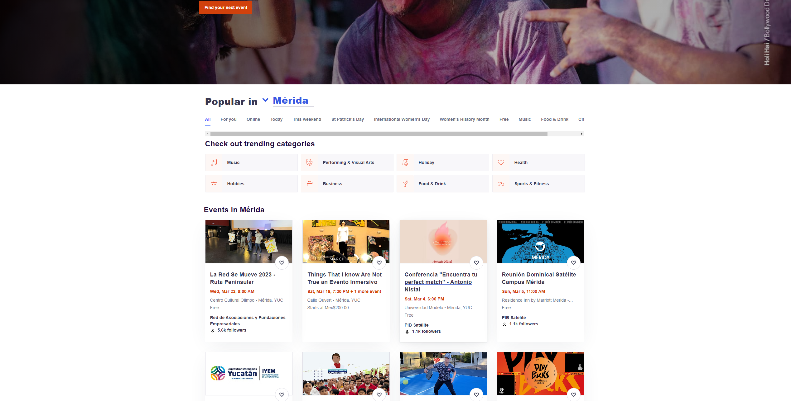
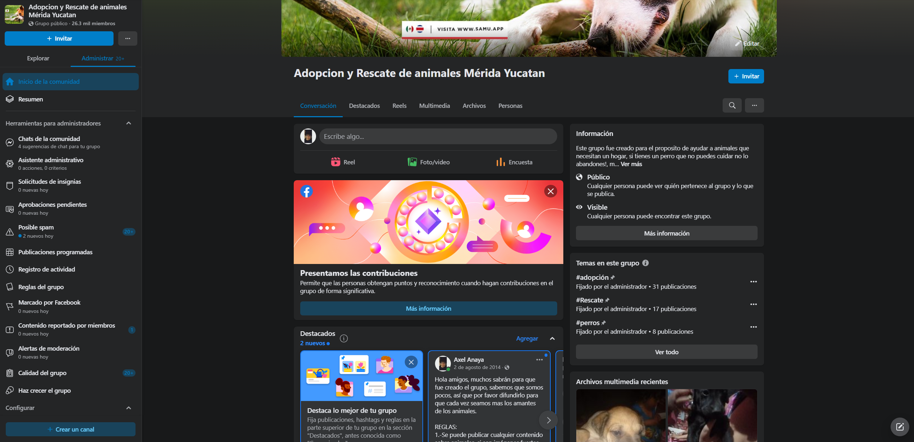

# First Delivery - Summary

## Problematic and context

Social cohesion refers to the grade of union and solidarity between people and groups in a society. This can be measured through trust, civic participation and cooperation in different fields.

This property from society is very significant for people’s lives, as it has been demonstrated that a bigger social cohesion is associated with greater individual and collective welfare, better mental health, and greater social and political stability.
On the other hand, the lack of healthy social cohesion brings onto people a feeling of isolation and detachment from their surroundings.

In order to take care of our societies, strategies must be developed to foment citizen participation, promote equal opportunities, foment dialogue and empathy, and strengthen social relations in our communities.
For that, the most appropriate focus would be dividing it into 6 distinguishable facets: Social relations, identification, orientation to the common good, shared values, quality of life, and inequality.

## Objective of the solution

Each facet is a huge field, so for this project we will center on 3 of them:

- Social relations
- Identification
- Orientation to the common good

Therefore we will focus our objectives in complementing those facets. For that, we must do the following:

- Connect people and initiatives
- Facilitate the development of initiatives
- Support the structure of initiatives

With that we establish 2 leading figures:

- Initiative: Collaborative effort made by a group of people, whether it be academic, recreational, professional or social.
- Persona

## User Profile and Scenarios

To resume our investigations, we need to know our users. For that we will define a bit more to whom we will refer to.
First we create a basic user profile based on our previously mentioned objectives.

Lastly combining everything we have previously elaborated we generate 2 possible scenarios in which our users could interact with our platform, so that they could aid us in refining our requirements in the future.

## Personas

With this profile a Fictional Persona is made with average characteristics from our user profile as a base, to have a precise look of how they think or look like, their possible motivations and the why of said motivations.

## Market analysis

During our research we considered observing similar systems to take as basis for the future elaboration of our product. From the noteworthy examples we have:

### Meetup

Meetup is a platform to find and build local communities. In our research we concluded that this platform wasn’t relevant for the simple reason of how impossible is to create groups about interests that aren’t already registered in the social network as well as failures in registering attendances.

### Eventbrite

Eventbrite is an event and sale entry management website that allows users to find, create and promote local events. It's greatest flaw was a lack of customer support, making users feel “ignored after giving them money”

### Facebook groups

Facebook provide to page owners a platform and tools necessary to create an active and relevant community with existing and potential customers. Their main flaw was that our target audience had left them behind for other social media. And it’s found out that these groups don’t work if they don’t have a sale/advertisement strategy or paid promotion, in addition that in most cases they require massive management.

## Requirements definition

With the context established, we can now define our requirements, starting with dividing the functions we need in our system.

First we define the basics:

- We need information about available initiatives.
- We also need to consider location, as it needs to be in a range where you can participate.
- An essential part of the system will be to contrast similar initiatives to see what elements they share in common and how those similar initiatives could be established.
- We also need to consider the possibility of creating new initiatives.

### Initial functional requirements

1. The user can search iniciatives
2. The user can search iniciatives based in location
3. The user can register their skills and experiences
4. The user can filter iniciatives by his skills and experiences
5. The user will have to log-in to the system to apply a iniciative
6. The user can register their iniciatives
7. The user can add events to his iniciatives
8. The user can add reviews to iniciatives in which they have participated.
9. The user can add the expected challenges for those who want to participate in his initiative
